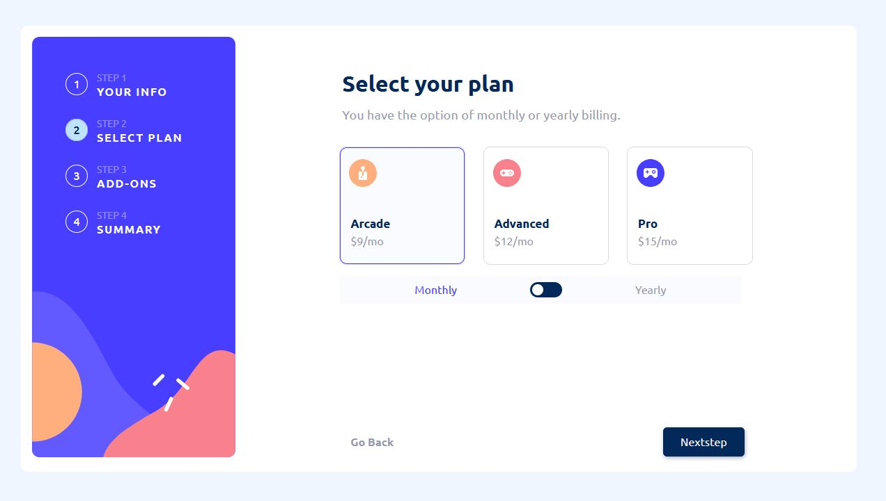

# Multi-step form

Un formulaire d'abonnement en quatre étapes : infos personnelles, choix de l'offre, options, puis récapitulatif avec calcul du total.



**Démo : [el-cassegrain.github.io/multi-step-form](https://el-cassegrain.github.io/multi-step-form/)**


## Contexte

Solution du challenge [Multi-step form](https://www.frontendmentor.io/challenges/multistep-form-YVAnSdqQBJ) de Frontend Mentor ([ma solution publiée](https://www.frontendmentor.io/solutions/responsive-multi-step-form-using-vuejs3-gazlNMgEvd)), réalisée en 2023 et mise à jour en 2026.

## Fonctionnalités

- Navigation entre les étapes, avec retour en arrière sans perte de saisie
- Validation native des champs (nom, e-mail, téléphone au format international)
- Bascule mensuel/annuel qui met à jour tous les prix
- Récapitulatif avec total calculé à partir de l'offre et des options choisies
- État partagé entre les étapes via un store Pinia
- Maquette responsive fidèle au design (sidebar desktop, stepper mobile)

## Installation

```bash
git clone https://github.com/El-Cassegrain/multi-step-form.git
cd multi-step-form
pnpm install
pnpm dev
```

`pnpm build` génère le site dans `dist/`. Le déploiement sur GitHub Pages est fait par GitHub Actions à chaque push sur `main`.

---

Réalisé par [Etienne Leriche](https://etienneleriche.com), designer UI/UX et développeur front-end.
